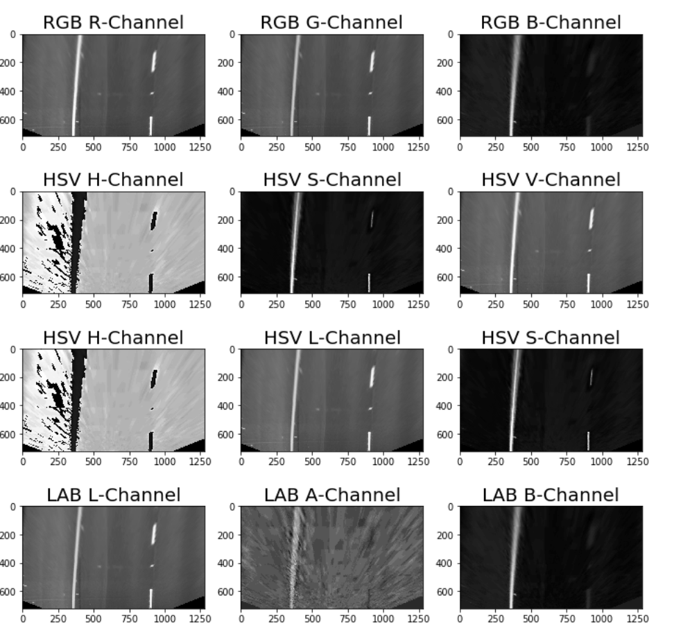

## Advanced Lane Finding

The goals / steps of this project are the following:

* Compute the camera calibration matrix and distortion coefficients given a set of chessboard images.
* Apply a distortion correction to raw images.
* Use color transforms, gradients, etc., to create a thresholded binary image.
* Apply a perspective transform to rectify binary image ("birds-eye view").
* Detect lane pixels and fit to find the lane boundary.
* Determine the curvature of the lane and vehicle position with respect to center.
* Warp the detected lane boundaries back onto the original image.
* Output visual display of the lane boundaries and numerical estimation of lane curvature and vehicle position.

## Rubric Points
Link to [rubric points](https://review.udacity.com/#!/rubrics/571/view) 

### Camera Calibration
##### 1. Briefly state how you computed the camera matrix and distortion coefficients. Provide an example of a distortion corrected calibration image

The code for the camera matrix and distortion can be found in the Jupyter notebook project3.ipynb (first 2 code cells).

A number of chessboard images are sampled in the camera_cal folder, where the images were taken from different angles with the same camera. The goal of this project is to undistort the distorted images and find the calibration matrix and distortion coefficients.

First cell in the notebook explains how the obj points, which are 3D points in real world are mapped to the img points, 2D points on the camera image. Mapping is done by finding the corners using the OpenCV functions findChessboardCorners and drawChessboardCorners.

Preview of corner drawn on images

#### 2. Describe how (and identify where in your code) you used color transforms, gradients or other methods to create a thresholded binary image. Provide an example of a binary image result.

Examples of the combination of sobel magnitude and direction thresholds:

##### Examples of color channels RGB, HSV:

If we notice the images, we see image calibration 1, 4, and 5 are empty. This is because the original image corners are hidden/out of the image scope. We had input 9X6 corners to the program and as program was not able to see enough corners it displayed blank images.

Preview of undistortion on images

Code for correcting distorted images can be found in cell 3, where OpenCV undistort function was used. This function undistorts the effects of distortion on any image. It takes obj and img points as input and return the callibration matrix and distortion coefficients as output. These are stored in calibration.p. 

### Pipeline (Single test Images)
 #### 1. Provide an example of a distortion-corrected image.
 
 Preview of undistorted images taken sample image from the test_images folder
 
 
 
 #### 2. 

