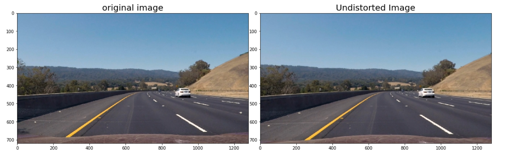
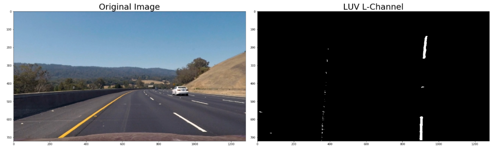
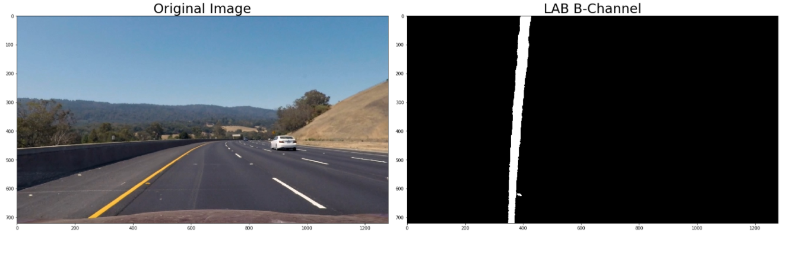
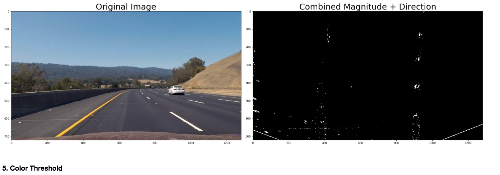
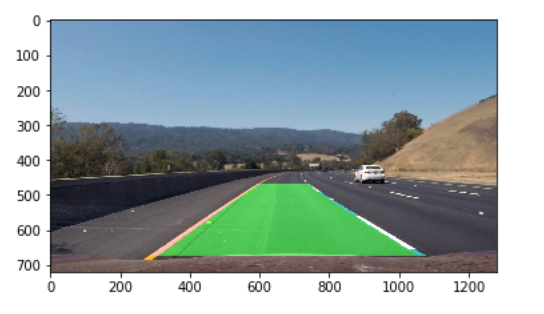
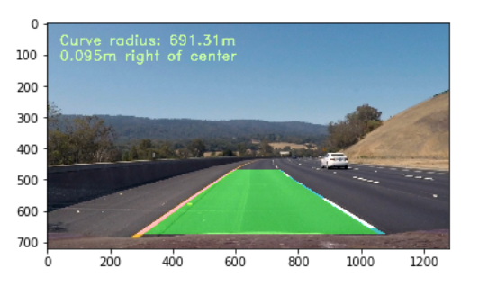

## Advanced Lane Finding

The goals / steps of this project are the following:

* Compute the camera calibration matrix and distortion coefficients given a set of chessboard images.
* Apply a distortion correction to raw images.
* Use color transforms, gradients, etc., to create a thresholded binary image.
* Apply a perspective transform to rectify binary image ("birds-eye view").
* Detect lane pixels and fit to find the lane boundary.
* Determine the curvature of the lane and vehicle position with respect to center.
* Warp the detected lane boundaries back onto the original image.
* Output visual display of the lane boundaries and numerical estimation of lane curvature and vehicle position.

## Rubric Points
Link to [rubric points](https://review.udacity.com/#!/rubrics/571/view) 

### 1. Camera Calibration
#####  a. Briefly state how you computed the camera matrix and distortion coefficients. Provide an example of a distortion corrected calibration image

The code for the camera matrix and distortion can be found in the Jupyter notebook project.ipynb (first 2 code cells).

A number of chessboard images are sampled in the camera_cal folder where, images were taken from different angles with the same camera. The goal of this section of th eproject is to undistort the distorted images and find the calibration matrix and distortion coefficients.

First cell in the notebook explains how the obj points, which are 3D points in real world are mapped to the img points, 2D points on the camera image. Mapping is done by finding the corners using the OpenCV functions findChessboardCorners and drawChessboardCorners.

If we notice the images, we see image calibration 1, 4, and 5 are empty. This is because the original image corners are hidden/out of the image scope. We had input 9X6 corners to the program and as program was not able to see enough corners it displayed blank images.

Preview of corner drawn on images

 

#### b. Apply a distortion correction to raw images.
Code for correcting distorted images can be found in cell 3, where OpenCV calibrateCamera and undistort function were used. Opencv function, calibrateCamera takes obj and img points as input and return the callibration matrix and distortion coefficients as output. These are stored in calibration.p. 

undistort function undistorts the effects of distortion on any image. It takes distorted image, callibration matrix and distortion coefficients as input and return undistorted image as output.

Preview of undistoretd chessboard image
 

 
### 2. Pipeline (Single test Images) 
 #### 1. Provide an example of a distortion-corrected image.
 As a first step we need to convert the original distorted image to undistorted image. Code for correcting distorted pipeline images can    be found in cell 5. 
 
 Preview of undistoretd test image.
 

#### 3. Describe how (and identify where in your code) you performed a perspective transform and provide an example of a transformed image.
   

This step is applied before thresholding, because error pixels in the binary are getting stretched out when the birds-eye transformation is performed second. Applying perspective before thresholding is resulting in better and clear lane lines

The openCV function unwarp() takes image,  source (src) and destination (dst) points as inputs. I picked 4 points in the source image which will form a trapezoid that would represent a rectangle when looking down on the road from above. 

#### 2. Describe how (and identify where in your code) you used color transforms, gradients or other methods to create a thresholded binary image. Provide an example of a binary image result.

##### a. Examples of Color transforms:
Code to identify which color channels would yield better results in identifying the lane lines can be found in notebook.

 Preview of various channels of three different color spaces for the same image. It is identified that
* RGB, R channel performed better in identifying lane lines
* HLS, S, L channel seems to recognize both Yellow and white lines better
* HSV, S channel seems to recognize both Yellow and white lines better.
* LAB, B channel seems to recognize yello lines better
* LUV, L channel seems to recognize white lines better

 Preview of color channels:
 

 
 #### b. Examples of Thresholds

 I decided to use below thresholds to identify which of these would yield better results in outputting better binary image.
 #### color threshold 
    * R and G channels, so yellow lanes are detected well. 
    
 
 
    * S channel performs well for detecting bright yellow and white lanes.
    
 

    * L channel for recignizing yellow lines 
    
 
 
     * B channel for recognizing white lines
     
     
     
  #### Gradients
     * combined sobel(along x direction) and direction gradient, as it was highlighing the lane lines more. (Cell 11)
     
 
   
   After trying all the thresolds which I have learned from Udacity review comments. L of LUV and B of LAB gave better resukts
   
  Preview of the final thresholded image.
   

   
 
  #### 4. Describe how (and identify where in your code) you identified lane-line pixels and fit their positions with a polynomial?
  
 After applying calibration, thresholding, and a perspective transform to a road test image, the resulted binary imagelane lines stand out clearly. But we still need to decide which pixels are part of the lines and which belong to the left line right line.

 #### Histogram:

As a first step I took a histogram along all the columns in the lower half of the image like this:

#### 4. Describe how (and identify where in your code) you identified lane-line pixels and fit their positions with a polynomial?

Functions sliding_window_polyfit and polyfit_using_prev_fit, identify lane lines and fit a second order polynomial to both right and left lane lines.  As a first step in identifying the lanes I computed the hostogram of the bottom half of the image to find the bottom most X position of the left and right lanes. In the Udacity lectures these locations were identified from the local maxima of the left and right halves of the histogram, but in my implementation I identifies using quarters of the histogram just left and right of the midpoint to reject lines from adjacent lanes. The image window was broken down to 10 windows to identify lane pixels, each one centered on the midpoint of the pixels to effectively follow the lane lines up to the top of the binary image. This speeds processing by only searching for activated pixels over a small portion of the image.The image below demonstrates how this process works:

The polyfit_using_prev_fit function performs basically the same task as sliding_window_polyfit. From the sliding window we know where the lines are.  In the next frame of video we don't need to do a blind search again, but instead we can just search in a margin around the previous line position. The image below is an example of previous poly fit \

#### 5. Describe how (and identify where in your code) you calculated the radius of curvature of the lane and the position of the vehicle with respect to center:

After the poly fit, we calculate the radius of curvature by defining the y-value where we want radius of curvature. This is done by chooseing  maximum y-value, corresponding to the bottom of the image. But the calculated radius will be in pixel space. To convert it in to real world space we need change the pixel space to meters.The lane is about 30 meters long and 3.7 meters wide,

    ym_per_pix = 30/720 # meters per pixel in y dimension
    xm_per_pix = 3.7/700 # meters per pixel in x dimension

Polynomials are fit in new world space:

    left_fit_cr = np.polyfit(ploty*ym_per_pix, leftx*xm_per_pix, 2)
    right_fit_cr = np.polyfit(ploty*ym_per_pix, rightx*xm_per_pix, 2)

and the radius of curvature was calculated as:

    left_curverad = ((1 + (2*left_fit_cr[0]*y_eval*ym_per_pix + left_fit_cr[1])**2)**1.5) / np.absolute(2*left_fit_cr[0])
    right_curverad = ((1 + (2*right_fit_cr[0]*y_eval*ym_per_pix + right_fit_cr[1])**2)**1.5) / np.absolute(2*right_fit_cr[0])

The position of the vehicle with respect to the center of the lane is calculated with the following lines of code:

#### 6. Provide an example image of your result plotted back down onto the road such that the lane area is identified clearly.

From the previous steps we have identified the left and right lane pixels, have arrays called left_fitx and right_fitx, which represent the x and y pixel values of the lines. we can then project those lines onto the original image as follows:
   
    * Create an image to draw the lines on
    * Recast the x and y points into usable format for cv2.fillPoly()
    * Draw the lane onto the warped blank image
    * Warp the blank back to original image space using inverse perspective matrix (Minv)
    * Combine the result with the original image

Below is an example of the results of the write_data function, which writes text identifying the curvature radius and vehicle position data onto the original image:

### Pipeline (video)

1. Provide a link to your final video output. Your pipeline should perform reasonably well on the entire project video (wobbly lines are ok but no catastrophic failures that would cause the car to drive off the road!).

### Conclusion
Final result of pipeline is project_video_out.mp4. The model seems to identify the lanes correctly. 

#### Points of failure & Areas of Improvement¶
The pipeline did not work well for both challenge and harder challenge video.

Challenge video has different light conditions

Shadows from lane divider
Lanes lines under different illumination conditions
Harder Challenge video has sharp turns

Steep curves
Shadows from tress
Different illumniation conditions
To Improve code for the challenge conditions:

Take a better Thresholding might help for challenge video as there are showdows from the different lane, we need to avoid those showdows .
Average over a smaller number of frames might help as for the harder challenge video the shape and direction of lanes changes quite fast.

The model fails when the image contains shades, and it will fail under many circumstances such as harsh weather conditions (snow, rain, fog, etc). In order to improve the model to successfully identify the lanes under theses conditions, we need to use a better way of reducing noises from images.
